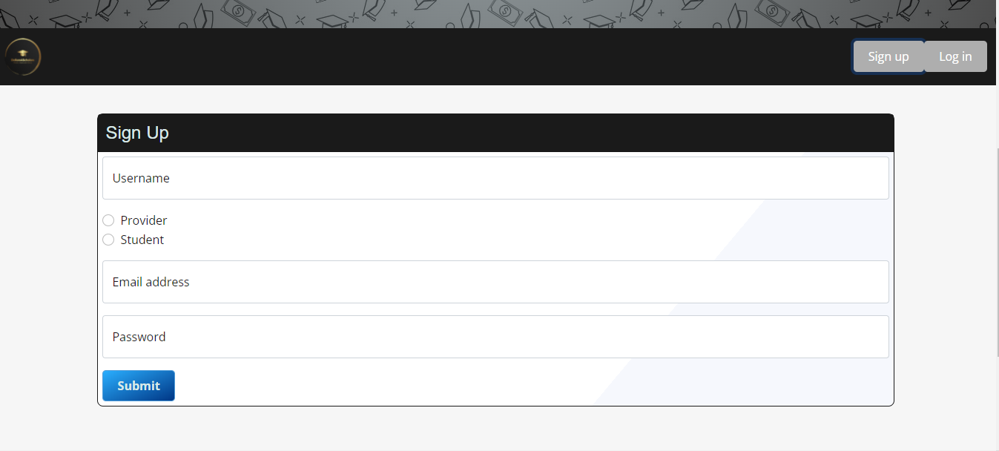
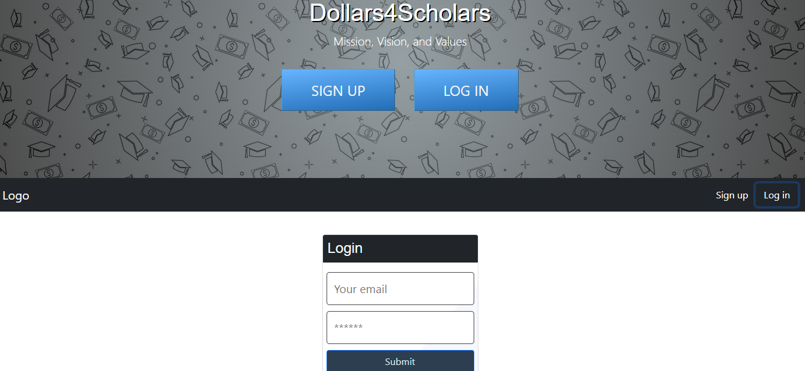
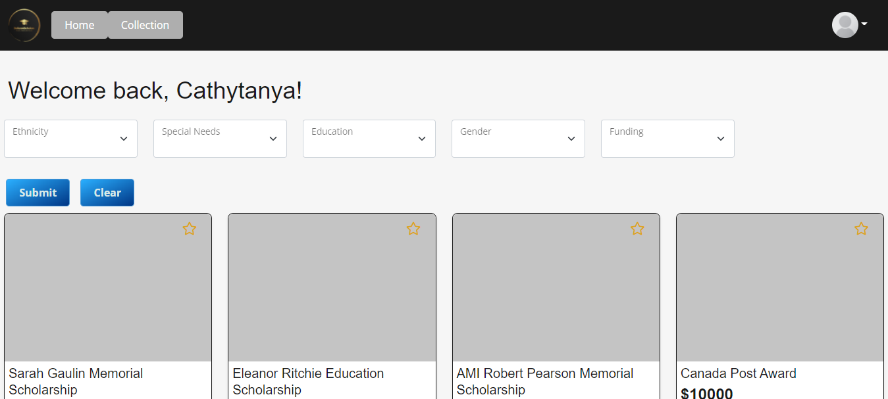
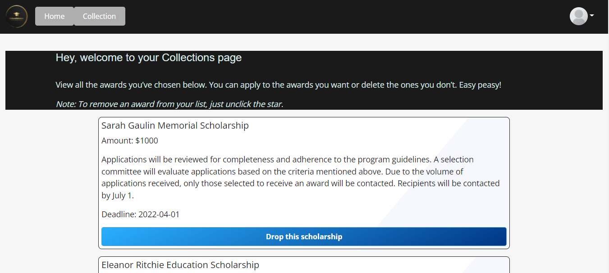
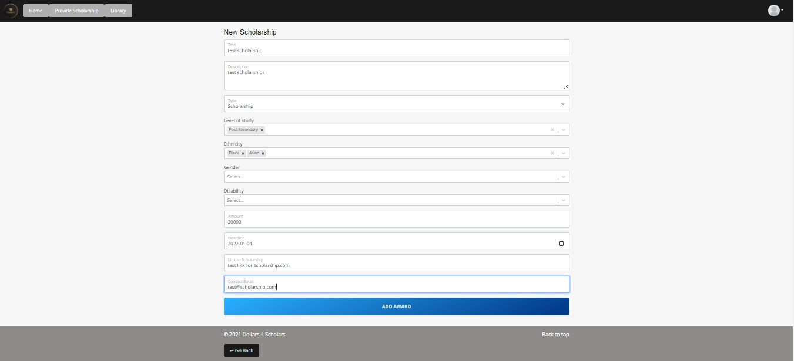

# Dollars4Scholars

## Table of Contents

  - [Description](#description)
  - [Installation](#installation)
  - [Usage](#usage)
  - [Credits](#credits)
  - [GitHub](#github)
  - [Features](#features)
  - [Tests](#tests)
  - [Heroku](#heroku)

## Description
This application has been built collaboratively with the student in mind. Entering post-secondary education can be a stressful time. Each year, tutition increases and paying for school becomes more of a predicament. The appication is geared toward minority students looking for scholarships and bursaries. A large portion of post-secondary students are comparised of minority students from various backgrounds and races, including Black, Indigenous and Asian. 

1. This web application will allow users to browse all the scholarships available 
2. The user can search for scholarships and bersaries by name or demographic
3. Once the student users signs-in, they can save specific scholarships to their account.
4. Once scholarship providers sign-in, they can add or drop scholarship from the platform.

The USER STORY goes as follow

    AS A user
    I WANT an application that will generate scholarships for minority groups
    SO THAT I can easily find a scholarship that is geared to user.

## Installation

No installation is needed. This application is run in a live webpage.

## Usage

To use this application, go to the deployed webpage by followig this link: [Visit the deployed page](https://aqueous-ocean-45024.herokuapp.com/)

Once on the landing page, go to the upper right corner and click on the user button to either sign up or login.

After logging on as a "student", the home screen will present available scholarships. At the top of the page, there are filters to assist the student in searching for a scholarship. Once a student likes a scholarship, it will be saved in their "Collections" folder.

After logging on as a "provider", a user can add a scholarship to the database by filling out a form.

## Credits

Collaborators:
- [Altug](https://github.com/altugcakmakci)
- [Gifty](https://github.com/giftilicious)
- [Andrés](https://github.com/aj-pena)
- [Cathy](https://github.com/cathytanya)
- [Summer](https://github.com/svilleneuve1994)

Third-party assets:
- [Bootstrap](https://getbootstrap.com/)
- [REACT](https://reactjs.org/)
- [JQuery](https://jquery.com/)
- [Mongoose](https://mongoosejs.com/)
- [fontawesome](https://fontawesome.com/)
- [npm](https://www.npmjs.com/)
- [bcrypt-npm](https://www.npmjs.com/package/bcrypt)
- [dotenv-npm](https://www.npmjs.com/package/dotenv)
- [sequelize-npm](https://www.npmjs.com/package/sequelize)
- [ExpressJs](https://expressjs.com/)
- [Express-Handlebars-npm](https://www.npmjs.com/package/express-handlebars)
- [Express-session-npm](https://www.npmjs.com/package/express-session)
- [mysql2-npm](https://www.npmjs.com/package/mysql2)
- [validatorjs-npm](https://www.npmjs.com/package/validatorjs)
- [Jest](https://jestjs.io/)
- [MySQL](https://www.mysql.com/)
- [Heroku](https://www.heroku.com/nodejs) 

Reference material:
- [w3schools](https://www.w3schools.com/)
- [StackOverflow](https://stackoverflow.com/)
- [Mozilla Developer Network](https://developer.mozilla.org/en-US/)

- [CSS-TRICKS guide to flexbox](https://css-tricks.com/snippets/css/a-guide-to-flexbox/)

## GitHub

If you want to know more details, feel free to [visit the repo](https://github.com/cathytanya/inout.git)

## Features

FrontEnd:
- Bootstrap grid, cards, forms and dropdowns
- Google Fonts and Fontawesome fonts and icons
- HTML/Handlebars
- CSS and Flexbox
- Dependencies:
  - @apollo/client 3.3.5
  - @testing-library/jest-dom 5.11.4
  - @testing-library/react 11.1.0
  - @testing-library/user-event 12.1.10
  - graphql 15.4.0
  - jwt-decode 3.1.2
  - react 17.0.1
  - react-bootstrap 2.0.2
  - react-dom 17.0.1
  - react-router-dom 5.2.0
  - react-scripts 4.0.1
  - react-select 5.2.1
  - styled-components 5.3.3
  - web-vitals 0.2.4

BackEnd:
- Heroku
- SQL / MySQL- 
- Object Oriented Programming
- Model View Controller framework
- Node.js
- File System
  

## Tests

Route: 
'public/js/test.js'

Test files: 

- test.js

How to run them: 

Fork the repo to a local folder.
From the local folder, open the command-line.
From the command-line (in the root folder of the local folder), run 'npm run test'.
You must install the npm jest dependency to be able to run the test using the mentioned command. 

## Heroku

https://aqueous-ocean-45024.herokuapp.com/
